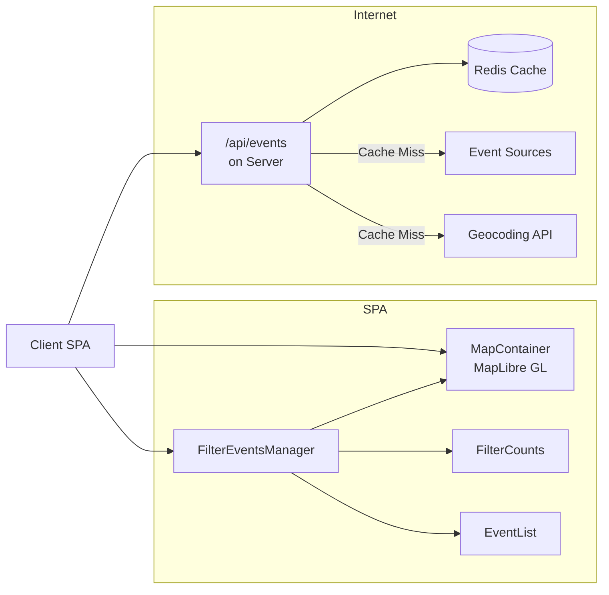
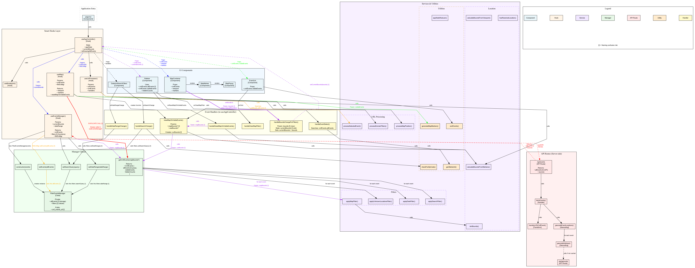
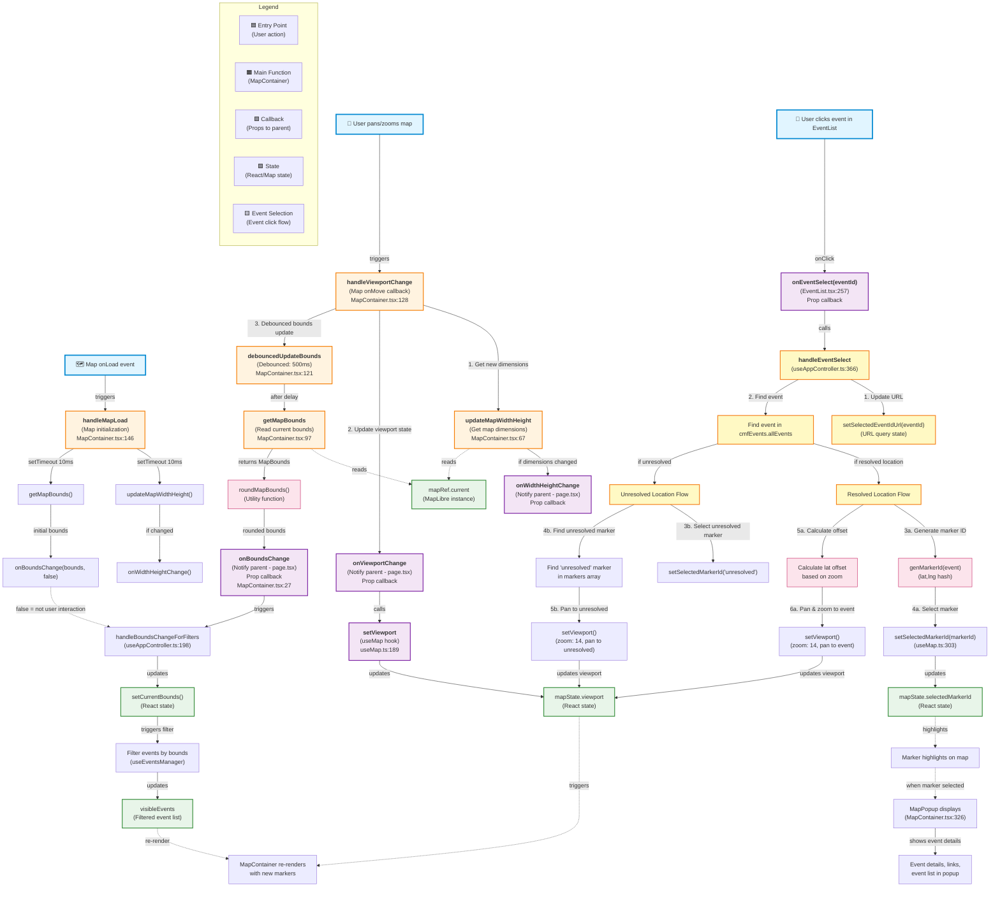

# ARCHITECTURE

**Goal:** Understand the code and system architecture for Calendar Map Filter (CMF).

**Audience:** new contributors, code reviewers
**Reading time:** ~8 minutes
**Update when:** a new subsystem is added, a data contract changes, or a major dependency shifts.

## Table of Contents

1. [TL;DR](#1-tldr)
2. [Components Overview](#2-components-overview)
3. [Typical Flow](#3-typical-flow)
    - [Happy Path: User Loads Events](#happy-path-user-loads-events)
    - [User Interaction: Filtering Events By Date](#user-interaction-filtering-events-by-date)
    - [Error Handling](#error-handling)
    - [Idempotency](#idempotency)
4. [Design Principles](#4-design-principles)
5. [Decisions & Rationale](#5-decisions--rationale)
    - [Key Architectural Decisions](#key-architectural-decisions)
    - [Technology Choices](#technology-choices)
6. [Data Flow & State Management](#6-data-flow--state-management)
    - [Application State Machine (8 States)](#application-state-machine-8-states)
    - [Core Data Structures](#core-data-structures)
    - [Data Flow Through System](#data-flow-through-system)
    - [Filtering Architecture: Two-Stage Model](#filtering-architecture-two-stage-model)
    - [Function Call Graph](#function-call-graph)
7. [Security & Data](#7-security--data)
8. [Sizing & Limits](#8-sizing--limits)
9. [Risks / TODOs / Open Questions](#9-risks--todos--open-questions)
10. [Reading Paths](#10-reading-paths)
11. [Maintainers / Update Policy](#11-maintainers--update-policy)

## 1. TL;DR

- **Goal:** Display calendar events on an interactive map with real-time filtering by date, search, and geographic area
- **Scope:** This repo owns: event fetching from multiple sources, client-side filtering, interactive map rendering, and geocoding with caching
- **Non-Goals:** Event storage/database, user authentication, event creation/editing, server-side event filtering
- **Invariants:**
    - Single-page React app with Next.js SSR for initial load
    - Client-side filtering using FilterEventsManager for all filter operations
    - MapLibre GL for mapping with react-map-gl wrapper
    - Event data flows: API → Client → Filtering → Map/List rendering
    - Smart Hook / Dumb Component architecture: business logic in hooks, pure rendering in components
    - Redis caching for geocoding (Upstash production, filesystem dev)
- **Big picture:** Client requests events → Server fetches & geocodes → Client filters → Map & list update in real-time



## 2. Components Overview

| Component               | Description                                     | Why it exists                                                            |
| ----------------------- | ----------------------------------------------- | ------------------------------------------------------------------------ |
| **Client SPA**          | React single-page app with Next.js              | Enables real-time filtering without server round-trips                   |
| **useAppController**    | Smart hook with all business logic (~550 lines) | Centralizes state management, separates business logic from UI           |
| **FilterEventsManager** | Client-side event filtering engine              | Performs fast filtering by date, search, map bounds without server calls |
| **MapContainer**        | MapLibre GL map component                       | Renders events geographically, handles viewport interactions             |
| **EventList**           | Sortable event table component                  | Displays filtered events in list format, synced with map                 |
| **API Routes**          | `/api/events`, `/api/geocode`                   | Fetches events from sources, geocodes locations with caching             |
| **Event Sources**       | Modular handlers for different event providers  | Extensible system: Google Calendar, Facebook, custom scrapers            |
| **Redis Cache**         | Upstash (prod) / Filesystem (dev)               | Reduces geocoding API calls, speeds up event loading                     |

---

## 3. Typical Flow

### Happy Path: User Loads Events

1. **User visits** `/?es=gc:calendar@gmail.com` (event source parameter)
2. **Client app** parses URL → triggers `/api/events?id=gc:calendar@gmail.com` request
3. **API endpoint** fetches events from Google Calendar API
4. **Geocoding** converts event locations to lat/lng coordinates (checks cache first)
5. **Cache stores** geocoding results in Redis (or filesystem in dev)
6. **API returns** `CmfEvent[]` array with resolved locations
7. **Client receives** events → FilterEventsManager initializes with all events
8. **URL filters applied** (if present): date filters (`qf`, `fsd/fed`), search (`sq`), selected event (`se`)
9. **Map renders** markers at geocoded locations
10. **Event list displays** all visible events synchronized with map

### User Interaction: Filtering Events By Date

1. **User changes date slider** → `handleDateRangeChange()` called
2. **FilterEventsManager** applies new date filter → recalculates visible events
3. **Map & list update** in real-time with filtered results
4. **Filter chip appears** showing "X Filtered by Date"
5. **URL updates** to reflect filter state (for sharing)

### Error Handling

- **Invalid event source:** Redirects to home page to select valid source
- **Geocoding failures:** Events placed at aggregate center (fallback location)
- **API errors:** Error message displayed, events not loaded
- **Unresolved locations:** All grouped at special "unresolved" marker

### Idempotency

- **URL parameters** fully represent app state (can reload and get same view)
- **Geocoding cache** prevents duplicate API calls for same addresses
- **Filter state** is deterministic based on current parameters

---

## 4. Design Principles

1. **Client-side filtering for performance** - All filtering happens in browser after initial event fetch, enabling instant updates
2. **URL as single source of truth** - All app state (filters, viewport, selected events) encoded in URL for easy sharing
3. **Smart Hook / Dumb Component separation** - Business logic in hooks (`useAppController`), pure rendering in components (`page.tsx`)
4. **Modular event sources** - Each source extends `BaseEventSourceHandler` for easy addition of new event providers
5. **Map is both input and output** - Map viewport acts as filter (input) while displaying filtered results (output)
6. **Fail gracefully** - Unresolved locations grouped at fallback marker, geocoding failures don't block event display

---

## 5. Decisions & Rationale

### Key Architectural Decisions

See [Architecture Decision Records (ADR)](adr/README.md) for detailed rationale. Key decisions:

- **Smart Hook / Dumb Component** ([ADR 2025-09-23](adr/2025-09-23-smart-hook-dumb-component-architecture.md)) - Extracted 500+ lines of business logic from `page.tsx` to `useAppController` hook, enabling independent testing and clear separation of concerns
- **React Context over Redux** ([ADR 2025-05-20](adr/2025-05-20-react-context-over-redux.md)) - Simpler state management for app size, hooks-based approach
- **Upstash Redis** ([ADR 2025-05-20](adr/2025-05-20-upstash-redis-for-geocoding-cache.md)) - Serverless Redis for geocoding cache, works with Vercel's serverless functions
- **Vercel Deployment** ([ADR 2025-05-20](adr/2025-05-20-vercel-deployment-platform.md)) - Automatic Next.js deployment with zero config, preview URLs for PRs
- **Tailwind CSS** ([ADR 2025-05-20](adr/2025-05-20-tailwind-css-implementation.md)) - Utility-first CSS for rapid UI development with shadcn/ui components
- **Viewport Parameter Pattern** ([ADR 2025-09-03](adr/2025-09-03-viewport-parameter-pattern.md)) - `llz` (lat,lon,zoom) consolidates map position into single URL parameter
- **Simplified FilteredEvents** ([ADR 2025-09-05](adr/2025-09-05-simplified-filtered-events-structure.md)) - Reduced from 7 arrays to 2 (`allEvents`, `visibleEvents`) + metadata
- **AppState Machine** ([ADR 2025-09-12](adr/2025-09-12-appstate-machine-over-useref-flags.md)) - 8-state machine replaces scattered useRef flags for predictable state transitions
- **Single-Pass Filtering** ([ADR 2025-10-01](adr/2025-10-01-single-pass-filtering-optimization.md)) - Optimized filtering to calculate counts and filter in one loop
- **Next.js 15 & React 19** ([ADR 2025-10-08](adr/2025-10-08-upgrade-nextjs-15-react-19.md)) - Major framework upgrade for performance and modern features

### Technology Choices

- **MapLibre GL** (not Google Maps) - Free, open-source mapping with full control over markers and interactions
- **Next.js App Router** - Server-side rendering for initial load, client-side SPA for interactions
- **SWR for data fetching** - Automatic caching, revalidation, and error handling
- **date-fns** - Modern date library with timezone support for client-side date operations
- **luxon** - Server-side timezone conversions (more robust timezone support than date-fns)

---

## 6. Data Flow & State Management

### Application State Machine (8 States)

```
starting-app           → Event source parsed from URL
    ↓
fetching-events        → SWR fetching events from /api/events
    ↓
processing-events      → resetMapToVisibleEvents, header setup
    ↓
applying-url-filters   → DateAndSearchFilters processes URL params (qf, fsd/fed, sq)
    ↓
parsing-remaining-url  → Handle selected event (se), llz viewport
    ↓
finalizing-setup       → Placeholder for tracking
    ↓
user-interactive       → Normal user interaction mode (filtering, clicking, etc.)
```

**Performance:** Complete progression from browser request to interactive state in ~2-5 seconds

### Core Data Structures

**CmfEvent** - Individual event with location, time, and metadata

```typescript
{
  id: string
  name: string
  description: string
  start: string // ISO 8601
  end: string   // ISO 8601
  tz?: string   // e.g., 'America/Los_Angeles'
  location: string
  resolved_location?: {
    status: 'resolved' | 'unresolved'
    formatted_address?: string
    lat?: number
    lng?: number
  }
  original_event_url: string
  src?: number  // source index when multiple sources
}
```

**CmfEvents** - Filtered event collection (was FilteredEvents)

```typescript
{
  allEvents: CmfEvent[]          // All events from sources
  visibleEvents: CmfEvent[]      // Events passing all filters
  hiddenCounts: {
    byMap: number                // Hidden by map bounds
    bySearch: number             // Hidden by search query
    byDate: number               // Hidden by date range
    byLocationFilter: number     // Hidden by location filter
  }
}
```

**DomainFilters** - Date and search filters (not map bounds)

```typescript
{
  dateRange?: {
    startIso: string  // ISO 8601 UTC
    endIso: string    // ISO 8601 UTC
  }
  searchQuery?: string
  showUnknownLocationsOnly?: boolean
}
```

**MapBounds** - Geographic viewport boundaries

```typescript
{
    north: number // Latitude -90 to +90
    south: number
    east: number // Longitude -180 to +180
    west: number
}
```

### Data Flow Through System

**Server-side (Event Fetching):**

```
Event Source Handler
  → API endpoint (/api/events?id=source:id)
  → Fetch events from external API/scraper
  → Transform to CmfEvent format
  → Geocode locations (with Redis caching)
  → Return EventsSourceResponse with CmfEvent[]
```

**Client-side (Filtering & Rendering):**

```
useAppController (smart hook)
  → useEventsManager (fetches via SWR)
  → FilterEventsManager (applies domain filters)
  → useMap (generates markers from visible events)
  → MapContainer & EventList (render visible events)
```

### Filtering Architecture: Two-Stage Model

1. **Domain Filters** (date, search) → determine core event set
    - Applied by FilterEventsManager
    - Independent of map viewport
    - Chips show count hidden by each filter

2. **Map Filter** (viewport bounds) → determines what's visible on map
    - Applied separately using MapBounds
    - Updates when map moves (user pans/zooms)
    - Chip shows events outside current viewport

**Key Insight:** Each filter is independent. Chip counts show events hidden by _that specific filter alone_, not cumulative filtering.

### Function Call Graph

The following png may help you understand all the core functions.
You can also view [force-directed graph layout with D3.js](https://chadn.github.io/cmf/function-call-graph.html)
which is currently focused on identifying problematic names, more at [Code Review: Naming Analysis](code-review-naming.md)

<div style="overflow-x:auto; -webkit-overflow-scrolling:touch;">
  
</div>

### Function Call Graph Map Related

```
User Interaction Flow (Pan/Zoom)

User pans/zoom map
→ handleViewportChange (Map onMove)
  ├─→ updateMapWidthHeight()
  │   └─→ onWidthHeightChange() [if dimensions changed]
  ├─→ onViewportChange(viewport)
  │   └─→ setViewport() [in useMap hook]
  │       └─→ updates mapState.viewport
  └─→ debouncedUpdateBounds() [500ms delay]
      └─→ getMapBounds()
          └─→ roundMapBounds()
              └─→ onBoundsChange(bounds, true)
                  └─→ Filter events in page.tsx
                      └─→ Re-render with new markers

User clicks event in EventList
→ onEventSelect(eventId) [EventList.tsx:257]
  └─→ handleEventSelect(eventId) [useAppController.ts:366]
      ├─→ setSelectedEventIdUrl(eventId) [updates URL]
      ├─→ Find event in cmfEvents.allEvents
      │
      ├─→ IF RESOLVED LOCATION:
      │   ├─→ genMarkerId(event) [generate lat,lng hash]
      │   ├─→ setSelectedMarkerId(markerId)
      │   │   └─→ Updates mapState.selectedMarkerId
      │   │       └─→ Marker highlights on map
      │   │           └─→ MapPopup displays
      │   └─→ setViewport(lat, lng, zoom: 14)
      │       └─→ Map pans/zooms to event location
      │
      └─→ IF UNRESOLVED LOCATION:
          ├─→ setSelectedMarkerId('unresolved')
          ├─→ Find 'unresolved' marker in markers array
          └─→ setViewport(unresolved marker location, zoom: 14)
              └─→ Map pans to unresolved marker

Map onLoad event
→ handleMapLoad
  └─→ setTimeout(10ms)
      ├─→ updateMapWidthHeight()
      │   └─→ onWidthHeightChange()
      └─→ getMapBounds()
          └─→ onBoundsChange(initialBounds, false)
              └─→ Initial event filtering
```

mmdc -i maps-functions-current.mmd -o maps-functions-current.mmd.png -w 1600 -H 1600



---

## 7. Security & Data

**Authentication:** None currently - public calendar URLs only

- Google Calendar requires calendar ID (public or accessible via link)
- Facebook events via iCal URL (user-specific, includes auth token)

**API Keys (Server-side only):**

- `GOOGLE_MAPS_API_KEY` - Geocoding API access (never exposed to client)
- `UPSTASH_REDIS_REST_URL/TOKEN` - Cache access (never exposed to client)

**Client-side Tokens:**

- `NEXT_PUBLIC_MAPBOX_ACCESS_TOKEN` - MapLibre GL (read-only, usage-limited)
- `NEXT_PUBLIC_UMAMI_WEBSITE_ID/URL` - Analytics (public, non-sensitive)

**Data Handling:**

- No PII stored on server (events fetched on-demand)
- Geocoding cache stores address → coordinates mapping
- No user accounts or authentication
- All data public (from public calendar or event sources)

**Retention:**

- Redis cache: TTL varies by event source (6-48 hours)
- No persistent event storage (fetched fresh each load)

---

## 8. Sizing & Limits

**Performance Targets:**

- Events per source: Optimized for <1000 events (tested successfully with over 5,000 events)
- Page load: ~2.5 seconds from URL to interactive
- Filtering: <20ms for 300 events (single-pass optimization)

**API Limits:**

- Google Calendar API: Standard quotas apply per calendar
- Google Maps Geocoding: Limited by API key quotas, mitigated by Redis cache
- MapLibre GL: Client-side rendering, no API limits

**Browser Constraints:**

- Map markers: Tested with 100+ markers (multiple events at same marker)
- Event list: Scrolling and jumping (clicking marker) tested with 3,000+ events
- Memory: Events stored in memory (allEvents + visibleEvents arrays)

---

## 9. Risks / TODOs / Open Questions

**Known Risks:**

- External event source APIs may change without notice (especially scrapers)
- Geocoding accuracy depends on event location quality (vague locations fail)
- Map performance degrades with 1000+ events (needs marker clustering)
- Timezone handling complex for events without explicit timezone data

**Performance Concerns:**

- Large event counts (>1000) not tested thoroughly
- Map re-renders on every filter change (could optimize with memoization)
- No virtual scrolling for event list (DOM size grows with events)

**Technical Debt:**

- Some event sources use custom parsing (19hz, foopee) - fragile to website changes
- Timezone conversion uses special constants (`UNKNOWN_TZ`, `REINTERPRET_UTC_TO_LOCAL`) - needs refactoring
- URL parameter handling spread across multiple hooks - could centralize further
- Test coverage gaps: map components (82%), hooks (33-65%), services (7%)

**Open Questions:**

- Should we implement event database for historical data?
- Client-side event caching (localStorage) for faster subsequent loads?
- Marker clustering for better performance with many events?
- User accounts and saved filter preferences?

---

## 10. Reading Paths

**New developer joining project?**
→ TL;DR → Typical Flow → Components Overview → Start coding with [Development Guide](development.md)

**Debugging filter issues?**
→ Data Flow & State Management → Filtering Architecture → [Troubleshooting in implementation.md](implementation.md#troubleshooting)

**Understanding state transitions?**
→ Application State Machine → [ADR: AppState Machine](adr/2025-09-12-appstate-machine-over-useref-flags.md)

**Adding new event source?**
→ Components Overview → [Event Sources README](../src/lib/api/eventSources/README.md)

**Performance optimization?**
→ Sizing & Limits → [ADR: Single-Pass Filtering](adr/2025-10-01-single-pass-filtering-optimization.md)

---

## 11. Maintainers / Update Policy

- **Maintainer:** @chadn
- **Update when:**
    - New subsystem added (e.g., user authentication, event database)
    - Data contract changes (CmfEvent, CmfEvents, API responses)
    - Major architectural shift (e.g., move to server-side filtering)
    - New state machine states added
    - External dependency changes (MapLibre → different mapping library)

**Do NOT update for:**

- Bug fixes that don't change architecture
- UI/styling changes
- New event sources (unless changes event source pattern)
- Performance optimizations (unless architectural approach changes)

That's all. You can also [view other docs](../docs/)
