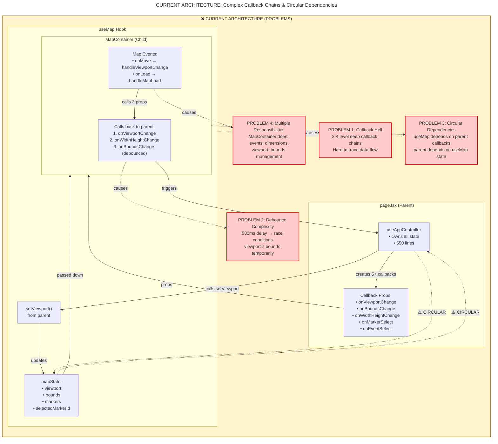
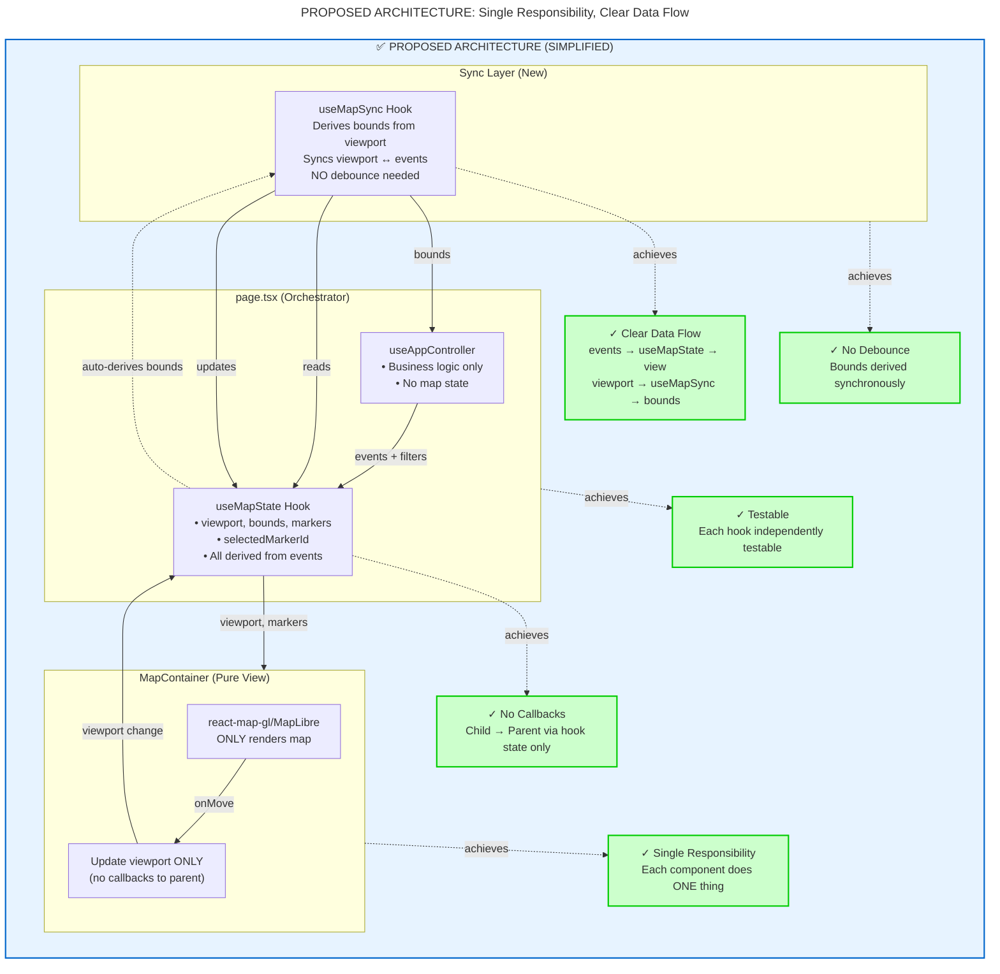

```mermaid
---
title: "CURRENT ARCHITECTURE: Complex Callback Chains & Circular Dependencies"
---
flowchart TD
    subgraph Current["❌ CURRENT ARCHITECTURE (PROBLEMS)"]
        direction TB

        subgraph PageTsx["page.tsx (Parent)"]
            AppController["useAppController<br/>• Owns all state<br/>• 550 lines"]

            AppController -->|"creates 5+ callbacks"| Callbacks

            Callbacks["Callback Props:<br/>• onViewportChange<br/>• onBoundsChange<br/>• onWidthHeightChange<br/>• onMarkerSelect<br/>• onEventSelect"]
        end

        subgraph MapContainerComp["MapContainer (Child)"]
            MapEvents["Map Events:<br/>• onMove → handleViewportChange<br/>• onLoad → handleMapLoad"]

            MapEvents -->|"calls 3 props"| CallbacksFromMap["Calls back to parent:<br/>1. onViewportChange<br/>2. onWidthHeightChange<br/>3. onBoundsChange (debounced)"]
        end

        subgraph UseMapHook["useMap Hook"]
            MapState["mapState:<br/>• viewport<br/>• bounds<br/>• markers<br/>• selectedMarkerId"]

            SetViewport["setViewport()<br/>from parent"]

            SetViewport -->|"updates"| MapState
            MapState -->|"passed down"| MapContainerComp
        end

        Callbacks -->|"props"| MapContainerComp
        CallbacksFromMap -->|"triggers"| AppController
        AppController -->|"calls setViewport"| SetViewport

        %% Show circular dependency
        AppController -.->|"⚠️ CIRCULAR"| MapState
        MapState -.->|"⚠️ CIRCULAR"| AppController

        Problem1["PROBLEM 1: Callback Hell<br/>3-4 level deep callback chains<br/>Hard to trace data flow"]
        Problem2["PROBLEM 2: Debounce Complexity<br/>500ms delay → race conditions<br/>viewport ≠ bounds temporarily"]
        Problem3["PROBLEM 3: Circular Dependencies<br/>useMap depends on parent callbacks<br/>parent depends on useMap state"]
        Problem4["PROBLEM 4: Multiple Responsibilities<br/>MapContainer does: events, dimensions,<br/>viewport, bounds management"]

        MapContainerComp -.->|"causes"| Problem1
        CallbacksFromMap -.->|"causes"| Problem2
        UseMapHook -.->|"causes"| Problem3
        MapEvents -.->|"causes"| Problem4
    end

    classDef problem fill:#ffcccc,stroke:#cc0000,stroke-width:2px
    classDef current fill:#fff3cd,stroke:#856404,stroke-width:2px

    class Problem1,Problem2,Problem3,Problem4 problem
    class Current current
```

---

```mermaid
---
title: "PROPOSED ARCHITECTURE: Single Responsibility, Clear Data Flow"
---
flowchart TD
    subgraph Proposed["✅ PROPOSED ARCHITECTURE (SIMPLIFIED)"]
        direction TB

        subgraph PageTsxNew["page.tsx (Orchestrator)"]
            AppControllerNew["useAppController<br/>• Business logic only<br/>• No map state"]

            MapHook["useMapState Hook<br/>• viewport, bounds, markers<br/>• selectedMarkerId<br/>• All derived from events"]

            AppControllerNew -->|"events + filters"| MapHook
        end

        subgraph MapContainerNew["MapContainer (Pure View)"]
            MapGL["react-map-gl/MapLibre<br/>ONLY renders map"]

            MapGL -->|"onMove"| ViewportOnly["Update viewport ONLY<br/>(no callbacks to parent)"]
        end

        subgraph SyncLayer["Sync Layer (New)"]
            MapSync["useMapSync Hook<br/>Derives bounds from viewport<br/>Syncs viewport ↔ events<br/>NO debounce needed"]

            MapSync -->|"reads"| MapHook
            MapSync -->|"updates"| MapHook
        end

        MapHook -->|"viewport, markers"| MapContainerNew
        ViewportOnly -->|"viewport change"| MapHook
        MapHook -.->|"auto-derives bounds"| MapSync
        MapSync -->|"bounds"| AppControllerNew

        Benefit1["✓ Single Responsibility<br/>Each component does ONE thing"]
        Benefit2["✓ No Callbacks<br/>Child → Parent via hook state only"]
        Benefit3["✓ No Debounce<br/>Bounds derived synchronously"]
        Benefit4["✓ Clear Data Flow<br/>events → useMapState → view<br/>viewport → useMapSync → bounds"]
        Benefit5["✓ Testable<br/>Each hook independently testable"]

        MapContainerNew -.->|"achieves"| Benefit1
        MapHook -.->|"achieves"| Benefit2
        SyncLayer -.->|"achieves"| Benefit3
        MapSync -.->|"achieves"| Benefit4
        PageTsxNew -.->|"achieves"| Benefit5
    end

    classDef benefit fill:#ccffcc,stroke:#00cc00,stroke-width:2px
    classDef proposed fill:#e7f3ff,stroke:#0066cc,stroke-width:2px

    class Benefit1,Benefit2,Benefit3,Benefit4,Benefit5 benefit
    class Proposed proposed
```

---

```mermaid
---
title: "DETAILED COMPARISON: Current vs Proposed Function Calls"
---
flowchart LR
    subgraph CurrentFlow["❌ CURRENT: User Pans Map"]
        direction TB

        C1["User pans map"]
        C2["MapLibre onMove"]
        C3["handleViewportChange"]
        C4a["updateMapWidthHeight()<br/>(check dimensions)"]
        C4b["onViewportChange(vp)<br/>(callback to parent)"]
        C4c["debouncedUpdateBounds()<br/>(500ms delay)"]
        C5["setViewport()<br/>(in useMap)"]
        C6["getMapBounds()<br/>(after 500ms)"]
        C7["onBoundsChange()<br/>(callback to parent)"]
        C8["handleBoundsChangeForFilters<br/>(in useAppController)"]
        C9["filtrEvtMgr.filterByBounds()"]
        C10["Re-render map + list"]

        C1 --> C2 --> C3
        C3 --> C4a
        C3 --> C4b
        C3 --> C4c
        C4b --> C5
        C5 --> C10
        C4c -.->|"ASYNC DELAY"| C6
        C6 --> C7
        C7 --> C8
        C8 --> C9
        C9 --> C10

        CProblems["PROBLEMS:<br/>• 10 function calls<br/>• 3 callbacks to parent<br/>• Race condition (viewport updates before bounds)<br/>• Hard to debug timing issues"]

        C10 -.-> CProblems
    end

    subgraph ProposedFlow["✅ PROPOSED: User Pans Map"]
        direction TB

        P1["User pans map"]
        P2["MapLibre onMove"]
        P3["setViewport()<br/>(update local state)"]
        P4["useMapSync detects<br/>viewport change"]
        P5["calculateBounds()<br/>(synchronous derive)"]
        P6["setBounds()<br/>(update local state)"]
        P7["useEffect triggers<br/>filter update"]
        P8["Re-render map + list"]

        P1 --> P2 --> P3
        P3 --> P4
        P4 --> P5
        P5 --> P6
        P6 --> P7
        P7 --> P8

        PBenefits["BENEFITS:<br/>• 7 function calls (30% fewer)<br/>• 0 callbacks to parent<br/>• Synchronous (no race conditions)<br/>• Easy to debug (linear flow)"]

        P8 -.-> PBenefits
    end

    subgraph EventClickCurrent["❌ CURRENT: Event Click"]
        direction TB

        E1["Click event in list"]
        E2["onEventSelect(id)<br/>(callback prop)"]
        E3["handleEventSelect()<br/>(in useAppController)"]
        E4["setSelectedEventIdUrl"]
        E5["Find event"]
        E6["genMarkerId()"]
        E7["setSelectedMarkerId()<br/>(callback to useMap)"]
        E8["setViewport()<br/>(callback to useMap)"]
        E9["Re-render"]

        E1 --> E2 --> E3
        E3 --> E4
        E3 --> E5
        E5 --> E6
        E6 --> E7
        E6 --> E8
        E7 --> E9
        E8 --> E9

        ECProblems["PROBLEMS:<br/>• 2 separate callbacks<br/>• Duplicated in handleMarkerClick<br/>• Logic split across files"]

        E9 -.-> ECProblems
    end

    subgraph EventClickProposed["✅ PROPOSED: Event Click"]
        direction TB

        EP1["Click event in list"]
        EP2["setSelectedEventId(id)<br/>(hook state only)"]
        EP3["useMapSync detects<br/>selection change"]
        EP4["Auto-calculates:<br/>• markerId<br/>• viewport for event"]
        EP5["Updates map state"]
        EP6["Re-render"]

        EP1 --> EP2
        EP2 --> EP3
        EP3 --> EP4
        EP4 --> EP5
        EP5 --> EP6

        EPBenefits["BENEFITS:<br/>• 0 callbacks<br/>• Single location for logic<br/>• Auto-syncs map to selection"]

        EP6 -.-> EPBenefits
    end

    classDef problem fill:#ffcccc,stroke:#cc0000,stroke-width:2px
    classDef benefit fill:#ccffcc,stroke:#00cc00,stroke-width:2px

    class CProblems,ECProblems problem
    class PBenefits,EPBenefits benefit
```

---

```mermaid
---
title: "KEY ARCHITECTURAL CHANGES"
---
flowchart LR
    subgraph Changes["CHANGES TO IMPLEMENT"]
        direction TB

        Change1["1. CREATE: useMapState Hook<br/>Owns: viewport, bounds, markers, selectedMarkerId<br/>Replaces: mapState in useMap"]

        Change2["2. CREATE: useMapSync Hook<br/>Derives bounds from viewport (sync)<br/>Syncs viewport when event selected<br/>Replaces: debouncedUpdateBounds, handleEventSelect viewport logic"]

        Change3["3. SIMPLIFY: MapContainer<br/>Remove: all callbacks to parent<br/>Remove: updateMapWidthHeight, getMapBounds<br/>Keep: only rendering logic"]

        Change4["4. SIMPLIFY: useMap → useMapMarkers<br/>Focus: marker generation only<br/>Remove: viewport, bounds management"]

        Change5["5. SIMPLIFY: useAppController<br/>Remove: map-specific callbacks<br/>Keep: business logic, event fetching, filters"]

        Change1 --> Change2
        Change2 --> Change3
        Change3 --> Change4
        Change4 --> Change5

        subgraph Benefits["BENEFITS"]
            B1["✓ Eliminate callback hell<br/>(5+ callbacks → 0 callbacks)"]
            B2["✓ Remove debounce complexity<br/>(sync bounds calculation)"]
            B3["✓ Break circular dependencies<br/>(unidirectional data flow)"]
            B4["✓ Single responsibility<br/>(each hook/component = 1 job)"]
            B5["✓ Easier testing<br/>(hooks testable independently)"]
        end

        Change5 --> Benefits
    end

    subgraph Migration["MIGRATION STRATEGY"]
        direction TB

        M1["Phase 1: Create useMapState<br/>Extract viewport/bounds from useMap<br/>NO behavior change yet"]

        M2["Phase 2: Create useMapSync<br/>Implement sync bounds calculation<br/>Test alongside debounced version"]

        M3["Phase 3: Update MapContainer<br/>Remove callbacks one at a time<br/>Verify each step"]

        M4["Phase 4: Simplify useAppController<br/>Remove map callbacks<br/>Update event selection logic"]

        M5["Phase 5: Cleanup<br/>Remove old code paths<br/>Update tests"]

        M1 --> M2 --> M3 --> M4 --> M5

        M5 -.->|"RESULT"| Result["RESULT:<br/>• ~100 lines removed<br/>• 0 callbacks<br/>• Simpler mental model<br/>• Easier debugging"]
    end

    classDef change fill:#fff3cd,stroke:#856404,stroke-width:2px
    classDef benefit fill:#ccffcc,stroke:#00cc00,stroke-width:2px

    class Change1,Change2,Change3,Change4,Change5,M1,M2,M3,M4,M5 change
    class B1,B2,B3,B4,B5,Result benefit
```
