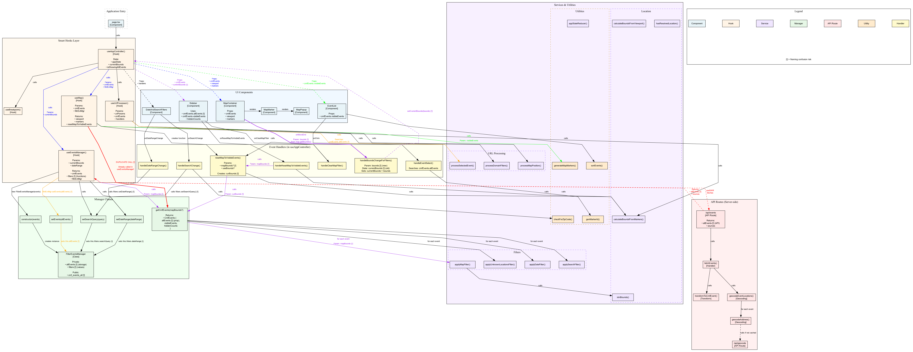

# Implementation

This document covers the technical implementation details for Calendar Map Filter (CMF). For architectural decisions and rationale, see [Architecture Decision Records (ADR)](adr/README.md).

## Table of Contents

- [Quick Reference](#quick-reference)
- [Architecture Overview](#architecture-overview)
    - [Architecture Principles](#architecture-principles)
        - [Pure Functions (Services)](#pure-functions-services)
        - [React Hooks](#react-hooks)
        - [Utility Functions](#utility-functions)
- [Key Data Structures and Data Flow](#key-data-structures-and-data-flow)
    - [Core Data Structures](#core-data-structures)
    - [Data Flow: Application State Machine](#data-flow-application-state-machine)
    - [Data Flow: Server Processing Event Source](#data-flow-server-processing-event-source)
- [URL Parsing](#url-parsing)
    - [URL Parsing Guidelines and Reasoning](#url-parsing-guidelines-and-reasoning)
- [Directory Structure](#directory-structure)
- [Troubleshooting](#troubleshooting)
    - [Common Issues and Solutions](#common-issues-and-solutions)
    - [Debug Tools](#debug-tools)
- [Deployment Configuration](#deployment-configuration)
    - [Environment Variables Required](#environment-variables-required)
    - [Deployment Steps](#deployment-steps)
    - [Build Configuration](#build-configuration)

## Quick Reference

**Key Files for Development:**

- `src/lib/hooks/useAppController.ts` - **Smart Hook** - All business logic and state management (550+ lines)
- `src/app/page.tsx` - **Dumb Component** - Pure rendering with props only (~50 lines)
- `src/lib/services/urlProcessingService.ts` - Pure URL processing business logic
- `src/lib/services/appStateService.ts` - State machine transition validation
- `src/lib/hooks/useEventsManager.ts` - Event data fetching and filtering
- `src/lib/hooks/useMap.ts` - Map interactions and viewport management
- `src/lib/events/FilterEventsManager.ts` - Core filtering logic
- `src/components/map/MapContainer.tsx` - Map rendering and interaction

**Architecture Decisions:** See [ADR Index](adr/README.md)

More details in [Development Guide](development.md).

## Architecture Overview

For a comprehensive architecture overview, see [ARCHITECTURE.md](ARCHITECTURE.md).

## Key Data Structures and Data Flow

### Core Data Structures

See [ARCHITECTURE.md](ARCHITECTURE.md#core-data-structures) for detailed data structure definitions.

**Quick reference:**

- **CmfEvent** - Individual event with location, time, metadata (defined in [types/events.ts](../src/types/events.ts))
- **CmfEvents** - Collection with `allEvents`, `visibleEvents`, `hiddenCounts` (defined in [types/events.ts](../src/types/events.ts))
- **MapState** - Map viewport, bounds, markers, selectedMarkerId (defined in [types/map.ts](../src/types/map.ts))
- **DomainFilters** - Date range and search query filters (defined in [types/events.ts](../src/types/events.ts))
- **URL parameters** - Defined in [types/urlparams.d.ts](../src/types/urlparams.d.ts), parsed in [url-utils.ts](../src/lib/utils/url-utils.ts)

### Function Call Graph




### Timezones

Managing timezones can be tricky since some sources have times for events without timezone information. Specifically websites can display times local to event or based on browsers timezone. For example, if you are in NYC looking at a show in SF that starts at 8pm, most likely that is 8pm SF time, which is 11pm NYC time.

Logic

- If no timezone is specified in source, assume time is local time to the location.

Code

- Special temporary timezone constants are used to let the code know the state of the start and end times
    - `UNKNOWN_TZ` if location not found after lat/lng has been resolved.
    - `CONVERT_UTC_TO_LOCAL` means source did not have timezone, stored as UTC, and will need to convert to LOCAL timezone after lat/lng are figured out.
    - `UNKNOWN_TZ|CONVERT_UTC_TO_LOCAL` if using UTC but time is actually local.
- Note [timezones.ts](../src/lib/utils/timezones.ts) has functions for server, uses luxon for timezones
- All client date parsing and converting should be done via [date-fns library](https://github.com/date-fns/date-fns) or functions in [date.ts](../src/lib/utils/date.ts), where dates are converted to local timezone when calculating what day an isoTime is.

### Data Flow

See [ARCHITECTURE.md](ARCHITECTURE.md#data-flow--state-management) for complete data flow documentation including:

- **Application State Machine** (8 states from `starting-app` to `user-interactive`)
- **Server-side event fetching** (API → Event Sources → Geocoding → Cache)
- **Client-side filtering** (useAppController → useEventsManager → FilterEventsManager → UI)

**Quick reference for debugging:**

- State transitions managed by `appStateReducer.ts` with actions in `appActions`
- URL processing handled by `useUrlProcessor` hook during initialization
- Event filtering uses two-stage model: domain filters (date, search) → map bounds filter

## URL Parsing

Note: llz is short for lat,long,zoom. For details on all URL params, see [types/urlparams.d.ts](../src/types/urlparams.d.ts)

App parses URL in the following order

| appState                | URL Parsing                                                                                                                             |
| ----------------------- | --------------------------------------------------------------------------------------------------------------------------------------- |
| `fetching-events`       | 1. `es` triggers event fetching on map page. No es, or invalid es, goes to home page                                                    |
| `applying-url-filters`  | 2. Apply any domain filters: search via `sq` and date via `qf` or `fsd` + `fed`, which override qf if qf is also present.               |
| `parsing-remaining-url` | 3. If `se` and it is a valid event id: act like user clicked on event (highlight on event list, show marker, zoom in). No more parsing. |
| `parsing-remaining-url` | 4. If `se` and not valid: act like se wasn't present, remove from URL, console log warning, and continue.                               |
| `parsing-remaining-url` | 5. If llz: update map based on llz coordinates, check the llz checkbox, update events visible without deviating from llz from URL.      |
| `parsing-remaining-url` | 6. If no llz and domain filters: zoom to visible events (e.g., if only 2 markers remain, zoom to those 2 markers)                       |
| `parsing-remaining-url` | 7. If no llz and no domain filters: zoom to fit all events                                                                              |

### URL Parsing Guidelines and Reasoning

- Prioritize map usefulness for finding events over sharing map-specific details
- llz in URL is not ideal since llz can lead to different map views on different devices due to varying screen sizes
- llz is still useful, so show in URL if llz checkbox is checked
- If qf=next7days or sq=berkeley reduces events to a few, map will zoom to those - makes map useful
- When map has se, qf, or sq active, lat/lon/zoom will not be in URL

## Directory Structure

```
/docs                           # Documentation
  /adr                          # Architecture Decision Records
/src
  /app                          # Next.js App Router
    /api                        # API routes
      /events                   # Events data endpoint
        /route.ts               # Main events API handler
      /geocode                  # Geocoding endpoint
      /info                     # System information endpoints
    /page.tsx                   # Main application page
    /layout.tsx                 # Root layout component
    /globals.css                # Global styles and CSS variables
    /loading.tsx                # Loading UI component
    /not-found.tsx              # 404 page component

  /components                   # React components by domain
    /common                     # Shared components
      /ErrorMessage.tsx         # Error display component
      /LoadingSpinner.tsx       # Loading indicator
    /events                     # Event-related components
      /EventList.tsx            # Sortable event table
      /EventDetails.tsx         # Event detail modal/popup
      /DateAndSearchFilters.tsx # Date range and search controls
      /DateQuickButtons.tsx     # Quick date selection buttons
    /home                       # Homepage-specific components
      /EventsSourceSelector.tsx  # Event source configuration UI
    /layout                     # Layout components
      /Header.tsx               # Application header
      /Footer.tsx               # Application footer
    /map                        # Map-related components
      /MapContainer.tsx         # Main map component (MapLibre integration)
      /MapMarker.tsx            # Custom map marker component
      /MapPopup.tsx             # Event popup on map
    /ui                         # Base UI components (shadcn/ui)
      /button.tsx               # Button component variants
      /calendar.tsx             # Calendar picker component
      /slider.tsx               # Range slider component

  /lib                          # Business logic and utilities
    /api                        # API client functions
      /geocoding.ts             # Google Maps geocoding with cache
      /eventSources/            # Event source integrations
        /19hz.ts                # 19hz.info music events
        /dissent-google-sheets.ts # WeThePeopleDissent.net events
        /facebookEvents.ts      # Facebook events (via iCal)
        /foopee.ts              # SF Bay Area music events
        /googleCalendar.ts      # Google Calendar integration
        /mobilize.ts            # Mobilize.us API events (multiple organizations)
        /nokings.ts             # No Kings protest events
        /plura/                 # Plura community events (with scraper)
        /protests.ts            # pol-rev.com protest events
        /testSource.ts          # Test events for E2E testing
        /BaseEventSourceHandler.ts # Base class for event sources
        /index.ts               # Event source registry
        /README.md              # Event source development guide
    /cache                      # Cache abstraction layer
      /upstash.ts               # Upstash Redis implementation (production)
      /filesystem.ts            # Filesystem cache (development)
      /index.ts                 # Cache interface and factory
    /config                     # Configuration management
      /env.ts                   # Environment variable validation and types
    /events                     # Event management logic
      /FilterEventsManager.ts   # Core event filtering and counting
      /filters.ts               # Filter utility functions
      /examples.ts              # Example event sources and shortIds
    /hooks                      # Custom React hooks
      /useAppController.ts      # **SMART HOOK** - All business logic (~550 lines)
      /useEventsManager.ts      # Event fetching, filtering, and state
      /useMap.ts                # Map viewport and marker management
      /useBreakpoint.ts         # Responsive breakpoint detection hook
    /services                   # **NEW** - Pure business logic (no React)
      /urlProcessingService.ts  # URL parsing and validation functions
      /appStateService.ts       # State machine transition validation
    /state                      # State management
      /appStateReducer.ts       # Application state machine and actions (8 states)
    /utils                      # Utility functions
      /date.ts                  # Date formatting and calculations
      /date-19hz-parsing.ts     # Date parsing for 19hz event source
      /date-constants.ts        # Date-related constants
      /headerNames.ts           # Dynamic header name determination utilities
      /icsParser.ts             # iCalendar format parsing
      /location.ts              # Location utilities and map bounds
      /logr.ts                  # Logging utility with rate limiting
      /quickFilters.ts          # Quick filter utilities for date ranges
      /timezones.ts             # Timezone detection and conversion
      /umami.ts                 # Analytics integration
      /url-utils.ts             # URL parameter parsing and validation utilities
      /utils-client.ts          # Client-side utilities
      /utils-server.ts          # Server-side utilities
      /utils-shared.ts          # Shared utilities
      /venue-parsing.ts         # Venue parsing utilities
    /utils.ts                   # Core utility functions

  /types                        # TypeScript type definitions
    /events.ts                  # Event, EventsSource, and filtering types
    /map.ts                     # Map-related types (viewport, bounds, markers)
    /urlProcessing.ts           # **NEW** - URL processing and state transition types

/public                         # Static assets
  /favicon.ico                  # Site favicon

/__tests__                      # Test files throughout codebase
  # Test files mirror source structure with *.test.tsx pattern
```

## Troubleshooting

### Common Issues and Solutions

**Map not loading:**

- Check `NEXT_PUBLIC_MAPBOX_ACCESS_TOKEN` in environment variables
- Verify MapLibre GL CSS is loaded in layout.tsx
- Check browser console for WebGL support

**Events not appearing:**

- Verify API keys in `.env.local` (Google Calendar, Maps)
- Check `/api/events` endpoint in Network tab
- Verify event source format: `prefix:id` (e.g., `gc:calendar@gmail.com`)

**Geocoding failures:**

- Check `GOOGLE_MAPS_API_KEY` has Geocoding API enabled
- Monitor quotas in Google Cloud Console
- Check cache hit rates in server logs

**Filter not working:**

- Verify FilterEventsManager state in React DevTools
- Check viewport bounds are being passed correctly
- Ensure filter dependencies in useMemo are correct

**Performance issues:**

- Check event count - optimize for <1000 events per source
- Monitor map marker rendering performance
- Verify useMemo dependencies are stable

### Debug Tools

**Client-side debugging:**

```javascript
// In browser console - access event data
window.cmfEvents = CmfEvents type
```

**Server-side logging:**

- Set `NODE_ENV=development` for detailed logs
- Check Vercel function logs for API issues
- Monitor Upstash Redis usage in dashboard

**React DevTools:**

- Inspect `useEventsManager` and `useMap` hook states
- Check component re-render causes
- Profile performance with React Profiler

## Deployment Configuration

**Deployment Platform Decision:** See [Vercel Deployment Platform ADR](adr/2025-05-20-vercel-deployment-platform.md) for rationale and alternatives.

### Environment Variables Required

```bash
# Google APIs
GOOGLE_MAPS_API_KEY=your_google_maps_key

# Upstash Redis Cache
UPSTASH_REDIS_REST_URL=your_upstash_url
UPSTASH_REDIS_REST_TOKEN=your_upstash_token

# MapLibre/Mapbox
NEXT_PUBLIC_MAPBOX_ACCESS_TOKEN=your_mapbox_token

# Optional: Analytics
NEXT_PUBLIC_UMAMI_WEBSITE_ID=your_umami_id
NEXT_PUBLIC_UMAMI_URL=your_umami_url
```

### Deployment Steps

1. **Connect Repository:** Link GitHub repository to Vercel project
2. **Environment Variables:** Configure secrets in Vercel dashboard
3. **Automatic Deployment:** Push to main branch triggers production deployment
4. **Preview Deployments:** Pull requests get preview URLs automatically

### Build Configuration

Vercel automatically detects Next.js and uses optimal build settings. Custom configuration via `vercel.json` if needed:

```json
{
    "functions": {
        "src/app/api/events/route.ts": {
            "maxDuration": 30
        }
    }
}
```

---

_For development setup and local running, see [development.md](development.md)_
_For user guide and features, see [usage.md](usage.md)_

# TEMP

OLD vs NEW states

```
  export type AppState =
 -    | 'events-init' // Fetching events from eventSource
 -    | 'events-loaded' // Events loaded, map markers can be generated
 -    | 'mapbounds-init' // Map component initialized, ready for domain filter processing
 -    | 'domain-filters-applied' // URL domain filters (date, search) processed and applied
 -    | 'url-processed' // All URL parameters processed (domain + map positioning)
 -    | 'mapbounds-calculated' // Map bounds calculated from filtered events and URL state
 -    | 'mapbounds-set' // Map bounds applied to filtering, ready for user interaction
 -    | 'main-state' // Normal user interaction mode

 +    | 'starting-app' // When successfully parses es, before fetching events, should transition to fetching-events
 +    | 'fetching-events' // SWR fetching events from API
 +    | 'processing-events' // resetMapToVisibleEvents, header setup
 +    | 'applying-url-filters' // DateAndSearchFilters processes date/search URL params
 +    | 'parsing-remaining-url' // Handle se, llz, auto-resize logic
 +    | 'finalizing-setup' // Final transition before interaction (placeholder for tracking)
 +    | 'user-interactive' // Normal user interaction mode
```
