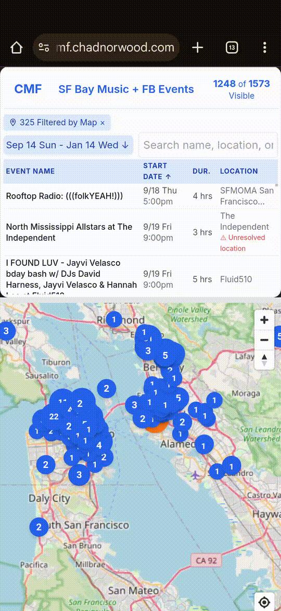
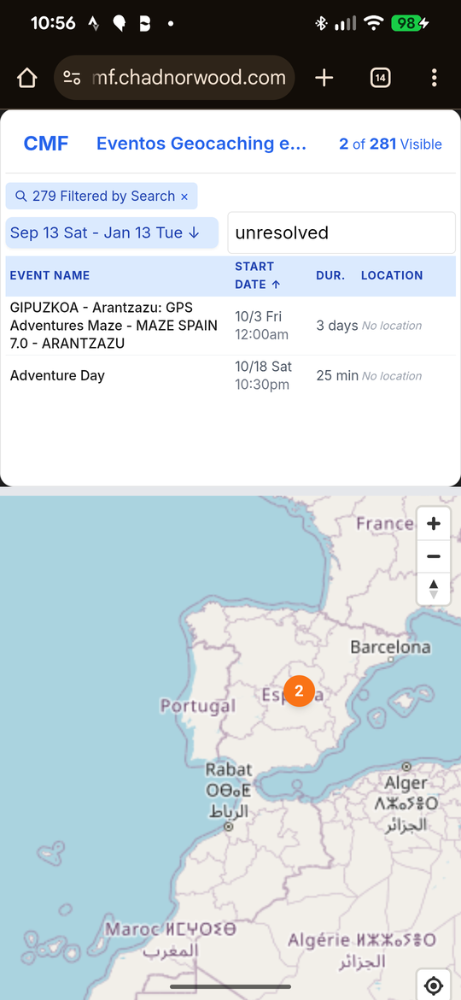
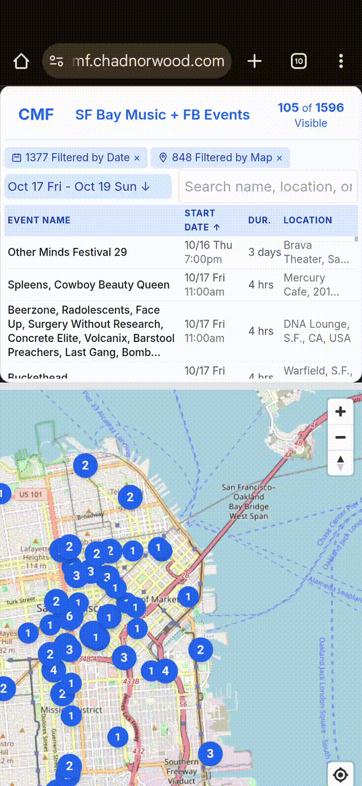

# How To Use CMF

Calendar Map Filter (CMF) is a web application that allows users to view and filter events on an interactive map. It supports various event sources and provides powerful real-time filtering capabilities.

## Table of Contents

- [Overview](#overview)
    - [Use Cases](#use-cases)
        - [What's Going On This Weekend](#whats-going-on-this-weekend)
        - [Explore Where The Action Is](#explore-where-the-action-is)
        - [Fix My Events With Bad Location](#fix-my-events-with-bad-location)
    - [Key Features](#key-features)
        - [Real-Time Data Updates](#real-time-data-updates)
        - [Map and Event List Integration](#map-and-event-list-integration)
        - [Location Requirements](#location-requirements)
    - [Definitions](#definitions)
        - [Selected Events Exception](#selected-events-exception)
- [Initial View: Pick Event Source](#initial-view-pick-event-source)
    - [Find your Google Calendar Id](#find-your-google-calendar-id)
    - [Find your Facebook Events iCal URL](#find-your-facebook-events-ical-url)
- [Map View: Main Page](#map-view-main-page)
    - [Map](#map)
    - [Event List](#event-list)
    - [Search Box](#search-box)
    - [Date Selector](#date-selector)
        - [Quick Filter Options](#quick-filter-options)
    - [Incorrect and Unresolved Locations](#incorrect-and-unresolved-locations)
    - [URL Parameters](#url-parameters)
        - [Event Source Parameters](#event-source-parameters)
        - [Map Viewport Parameters](#map-viewport-parameters)
        - [Date Parameters](#date-parameters)
        - [Search Parameters](#search-parameters)
        - [Selected Event Parameters](#selected-event-parameters)
    - [Date Formats](#date-formats)
    - [Example URLs](#example-urls)
    - [Event Sources](#event-sources)
    - [Event Sources and CMF About Popups](#event-sources-and-cmf-about-popups)
- [Other Notes](#other-notes)
    - [Mobile vs Desktop Features](#mobile-vs-desktop-features)
        - [Desktop Experience](#desktop-experience)
        - [Mobile Experience](#mobile-experience)
        - [Cross-Device Features](#cross-device-features)
    - [Troubleshooting](#troubleshooting)
    - [More](#more)

# Overview

CMF combines calendar event data with geographic visualization, allowing users to:

- View events from multiple sources on a map
- See same events in a list next to the map
- Filter events by date range (date filter), search terms (search filter), and geographic area (map filter)
- Share filtered views via URL parameters - just copy paste the URL!

(\*) One of the most unique features is how all the data updates real time as you interact with the map.
For example, as you adjust the date slider, you can see the real-time changes on what markers are showing in the map
and changes on the numbers of how many events are showing and filtered by date.

## Use Cases

### What's Going On This Weekend

Use date quick filter, Weekend, to only see events happening Friday, Saturday, and Sunday.
Click on Events in the list to see details in the map via the marker popup.

Notice in the following example that the visible event count drops from 1248 to 171 when Weekend button is pressed.
Clicking on the "1356 Filtered by Date x" button (or chip) removed the Weekend date filter, increase visible event count.

### Explore Where The Action Is

Noticing a bunch of events all near each other often points to a cool part of town.
Use the map to zoom in, filtering out all events not in that part of town, to make it easy to learn more about that cool neighborhood.

Images coming soon

### Fix My Events With Bad Location

If you have a public google calendar with lots of events, you can use CMF to confirm all the events have good locations.
A good location just means that the location can be resolved to an address or specific location on a map.
So `unresolved` locations are ones that are not good. You can focus CMF on unresolved locations using that as search term.

For example, here's all the unresolved locations for this public Google calendar for Spain
[cmf.chadnorwood.com/?es=gc:geocachingspain@gmail.com&sq=unresolved](https://cmf.chadnorwood.com/?es=gc:geocachingspain@gmail.com&sq=unresolved)

## Key Features

- Explore using map, visible events, and filters. As you filter, either by moving map, changing dates, or search terms,
  the number of visible events can reduce to only a handful.
- Clicking on Visible button will zoom and center on remaining visible events.
- Clicking on map chip (X Filtered by Map) will zoom out again and remove chip.
- Remove all chips to view all events.

### Real-Time Data Updates

- Instantly updates as you interact with map, search, or date changes. This encourages interactivity.
- Enable user to have some control in "too much" or "not enough" data type experiences.
- The events list and map markers stay synchronized, as well as the count of visible events, ones showing on the map.
- Filter counts on the chips update in real-time as you interact.

### Map and Event List Integration

- The map and list views are always synchronized.
- Clicking a marker highlights via green background the corresponding event in the list.
- The list shows only events visible on the current map view.

### Location Requirements

- Events must have a valid location to appear accurately on the map.
- Locations can be addresses, coordinates, or unique place names.
- Events with unresolved locations will all be placed in the same location, roughly in the center of other locations.

## Definitions

1. **Event Source** - A data provider for events, such as a Google Calendar or event websites like pol-rev.com. All sources are listed in [src/lib/api/eventSources](https://github.com/chadn/cmf/blob/main/src/lib/api/eventSources)
2. **Event** – Contains name, location, date, and description. Multiple events can occur at the same location or time. Events may repeat.
3. **Visible Events** - Events within the map container (map bounds) that pass all active filters (search, date). The "X of Y Visible" button shows counts where Y is total events and X is events not filtered out.
4. **Selected Event** - A focused event indicated by three visual cues: map marker popup, highlighted event row (green background) in the Event List, and URL updated with `se` parameter. Can be triggered by:
    - Clicking a map marker (popup appears, map doesn't change)
    - Clicking an event row (map centers and zooms to marker)
    - Loading page with `se` URL parameter (same as clicking event row)

    To deselect: close the marker popup. Tip: if you don't see popup, remove all chip filters by clicking on them.

5. **Map Container** – The visible map area in your browser (measured in pixels). Events outside this geographic area aren't part of "Visible Events". Map bounds (north/south/east/west coordinates) correspond to the geographic area shown.
6. **Location** – Where an event occurs. Should be an address, coordinates, or unique identifier suitable for geolocation. Vague locations like "Mom's house" cannot be mapped accurately.
7. **Marker** – A numbered circle on the map indicating visible event count at that location. Clicking selects the first event at that location.
8. **Marker Popup** - Detail panel above a marker showing events at that location, including start time in local timezone of event. May contain multiple events. Closes via X button at top right. While open, map is in [Selected Events Exception](#selected-events-exception) mode.
9. **Event List** – Filterable table of visible events, displayed above map (mobile) or beside map (desktop). Sortable by name, date, duration, location. Click headers to sort.
10. **Filters** – Clickable **Chips** above the event list (e.g., "xx Filtered By Map"). Three types exist: map, date, and search. Click any chip to remove that filter.
11. **Map Filter** - Geographic filtering based on current map view. Events outside the map container are filtered out. Remove by clicking "Filtered by Map" chip, which will update map so that all events could fit in map container.
12. **Search Filter** - Text-based filtering. Type characters to filter events by name, description, or location. Count shown in "Filtered by Search" chip.
13. **Date Filter** - Temporal filtering using date sliders and more (hidden by default). Click on Dates Selector above Event List to reveal popup to change start and end date range.

### Selected Events Exception

- Context - When a user clicks on event in event list, triggering selected event, the map container will change in order to show the event on the map by centering the map on the event's marker and showing a marker popup.
- Normal: Since map updated, event list and visible count would update to reflect the updated map bounds.
- Exception: Even though map changed, we will freeze event list, visible events count, and map chip - they do not update. They will unfreeze when there is no longer a selected event. To remove selected event, close the Marker Popup or click on map chip.
- Reason: We want to enable user to easily browse event list by clicking on events without the event list changing each time. If this exception did not exist, the UX creates too much change for user who is just browsing.

# Initial View: Pick Event Source

Here you can choose an example event source or type in your own.
To use examples, click on the links.

## Find your Google Calendar Id

1. Go to Google Calendar in your browser, https://calendar.google.com/
2. Find the calendar you want to use in the left sidebar
3. Click the three dots next to the calendar name
4. Select "Settings and sharing"
5. Scroll down to "Integrate calendar" section
6. Copy the "Calendar ID" - it will look like `example@gmail.com` or `NNNNNNN@group.calendar.google.com`

## Find your Facebook Events iCal URL

1. On Desktop, go to https://www.facebook.com/events/calendar in your browser, log in
2. Find the "Add to calendar" button near the top right of the Events page
3. Right Click the "Add to calendar" button, then select "Copy Link Address"
   Ex: `https://www.facebook.com/events/ical/upcoming/?uid=123456789&key=ABCDEFGHIJK`
4. Paste this URL directly in the event source field in CMF
5. The app will automatically convert it to the proper format (`fb:123456789-ABCDEFGHIJK`)

Note

- Facebook events only include your upcoming events that you've marked as "Going" or "Interested".
- Facebook events only include the past month and the next 3 months

# Map View: Main Page

It may take a second or 2 for the app to fetch all the events and put them on the map.
When it is ready, you will see

- A map with markers, where each marker has one or more events.
- The event list with names, dates, and location info of current events
- Search box to find events
- Date ranges that you can CHANGE to limit events to a smaller window

It is meant for you to play around!

## Map

The map container, or just map, will have markers for each location where there are one or more events.
Click on a marker to see the events at that location, including a link back to original event.

The map container shows where events are AND acts as a filter. When you zoom in so that markers go off the map, the events
at that location will be filtered out and not appear on the events list.

## Event List

The event list is basically a table listing the events that are currently shown on the map.
It has the following sortable columns - click on column name to sort or reverse sort by that column:

- Event Name - Name as appears in original event.
- Start Date - Date and time the event starts. Time is based on your browser's timezone, which may differ from local time of event.
- Duration - number of hours or days. If end time is unknown, `??` will be shown.
- Location - address as listed in event. If address is online or otherwise unresolvable by google maps api, it will say "Unresolved location" as well.

## Search Box

The search box is primarily used to find specific events. When you start typing part of a word, the events will be filtered
out so that the only ones shown are ones matching the letters you type. Matching includes partial matches against name, description and location (via [applySearchFilter](https://github.com/search?q=repo%3Achadn%2Fcmf%20applySearchFilter&type=code)).

Search box also allows for special searching.

- **unresolved** - typing `unresolved` will show all events with [Incorrect and Unresolved Locations](#incorrect-and-unresolved-locations)
- **zip codes** - typing a zip code, and on the 5th number of a valid zip code the map will update to go to that zip code.
  To actually search events for a zipcode, enter a space after 5th number.

## Date Selector

Similar to search box, you can filter events based on date ranges. Click on the button showing date ranges, next to search box, to open the date selector popop. Use the sliders, quick filters, or calendar to select start and end days you would like. Only events that occur in that window will show up on the map and event list.

### Quick Filter Options

The `qf` parameter is set when user clicks the corresponding button under the Date sliders.
It supports the following values:

- `past`: Events from the past up to today
- `future`: Events from today into the future
- `today`: Events happening today
- `next3days`: Events in the next 3 days
- `next7days`: Events in the next 7 days
- `weekend`: Events happening this weekend (Friday to Sunday)

## Incorrect and Unresolved Locations

**Unresolved locations** are events with either blank location or unresolvable (online, zoom, short name, etc). If there is not a unique location string, these cannot be fixed on the app side, must be fixed on event source side. If there is a unique location string, it may be possible to fix on the app side by updating the geolocation cache - see fix-location hack below.
All unresolved locations share a special marker. You can see them with special search term "unresolved". Ex: [?sq=unresolved&es=sf](https://cmf.chadnorwood.com/?sq=unresolved&es=sf)

**Incorrect locations** are when an event has a location but it appears to be incorrect on the map. It probably got incorrectly geocoded, maybe due to lack of location details. These can be often be fixed on the app side, by updating the geolocation cache.

**Report-location** To report incorrect locations, click on event or marker. In the Marker Popup, click on "Add To Cal", which will create another little popup. In that one, click "Report Incorrect Location"

**Fix-location** To fix incorrect locations - This is for admins only

1.  On map, Click on it, in event popup, hover over "View Original Event" to get location key (k1) (or look at html and copy title). ex: `location:Asiento`
1.  Figure out what location it should be, and store in geolocation cache, noting the key name (k2). ex:
    `curl 'https://cmf.chadnorwood.com/api/geocode?a=Asiento,sf,ca'`
1.  Update value for location key using [upstash-redis.ts](https://github.com/chadn/cmf/blob/main/src/scripts/upstash-redis.ts) `fix-location <k1> <k2>`
    `node upstash-redis.ts fix-location 'location:Asiento' 'location:Asiento,sf,ca'`

## URL Parameters

CMF supports several URL parameters that allow for deep linking and sharing specific views:

### Event Source Parameters

| Parameter | Description     | Example                           |
| --------- | --------------- | --------------------------------- |
| `es`      | Event source ID | `es=gc:geocachingspain@gmail.com` |
|           |                 | `es=fb:123456789-ABCDEFGHIJK`     |

### Map Viewport Parameters

| Parameter | Description                        | Example                    |
| --------- | ---------------------------------- | -------------------------- |
| `llz`     | lat,long,zoom (combined parameter) | `llz=45.5231,-122.6765,12` |
|           |                                    | old way:                   |
|           | Map center latitude (-90 to 90)    | `lat=45.5231`              |
|           | Map center longitude (-180 to 180) | `lon=-122.6765`            |
|           | Map zoom level (0-22)              | `z=12`                     |

### Date Parameters

| Parameter | Description                           | Example                                        |
| --------- | ------------------------------------- | ---------------------------------------------- |
| `qf`      | Quick filter for date ranges          | `qf=next7days`                                 |
| `sd`      | Start date for event fetching         | `sd=-1m` (1 month ago, default)                |
| `ed`      | End date for event fetching           | `ed=3m` (3 months from now, default)           |
| `fsd`     | Filter start date (user controllable) | `fsd=1d` (1 day from now) or `fsd=2025-12-20`  |
| `fed`     | Filter end date (user controllable)   | `fsd=14d` (2 weeks from now) or `fed=2026-1-1` |

**Note**: `sd`/`ed` control what events are fetched from the source, while `fsd`/`fed` control user filtering within that range. User filter dates (`fsd`/`fed`) must be within the source fetch range (`sd`/`ed`).

### Search Parameters

| Parameter | Description                                       | Example         |
| --------- | ------------------------------------------------- | --------------- |
| `sq`      | Search query to filter events                     | `sq=beat`       |
| `sq`      | &nbsp; Special query to list unresolved locations | `sq=unresolved` |
|           | &nbsp; Special query to list unresolved locations | `sq=unresolved` |

### Selected Event Parameters

| Parameter | Description       | Example        |
| --------- | ----------------- | -------------- |
| `se`      | Selected event ID | `se=event_123` |

## Date Formats

The application supports various date formats for the `sd` and `ed` parameters:

- **ISO 8601**: `2023-05-15`
- **Relative dates**:
    - `-1m`: 1 month ago
    - `3m`: 3 months from now
    - `-7d`: 7 days ago
    - `14d`: 14 days from now
    - `-2w`: 2 weeks ago
    - `1y`: 1 year from now

## Example URLs

Here are some example URLs showing different parameter combinations:

- View Events in SF: [cmf.chadnorwood.com/?es=sf](https://cmf.chadnorwood.com/?es=sf)
- Basic Google Calendar view: [?es=gc:geocachingspain@gmail.com](https://cmf.chadnorwood.com/?es=gc:geocachingspain@gmail.com)
- View Facebook events: [?es=fb:123456789-ABCDEFGHIJK](https://cmf.chadnorwood.com/?es=fb:123456789-ABCDEFGHIJK)
- View events in a specific location, Barcelona: [?llz=41.38233,2.15997,9&es=gc:geocachingspain@gmail.com](https://cmf.chadnorwood.com/?llz=41.38233,2.15997,9&es=gc:geocachingspain@gmail.com)
- View events happening over the next week: [?qf=next7days&es=gc:geocachingspain@gmail.com](https://cmf.chadnorwood.com/?qf=next7days&es=gc:geocachingspain@gmail.com)
- Search for specific events: [?sq=meet&es=gc:geocachingspain@gmail.com](https://cmf.chadnorwood.com/?sq=meet&es=gc:geocachingspain@gmail.com)
- View events up to 9 months from now: [?ed=9m&es=gc:geocachingspain@gmail.com](https://cmf.chadnorwood.com/?ed=9m&es=gc:geocachingspain@gmail.com)
- View events that have unresolved locations (then fix those locations!): [?sq=unresolved&es=sf](https://cmf.chadnorwood.com/?sq=unresolved&es=sf)

Note: You can replace `geocachingspain@gmail.com` with your actual Google Calendar ID.

## Event Sources

There are 2 types of event sources

- generic ones like google calendar or facebook where you enter your specific calendar feed
- custom ones like 19hz that parse a website, requiring custom code.

The code is written to make it easy to add different type of event sources, custom ones that do not have to be a calendar.
Read more about the [Event Sources System](https://github.com/chadn/cmf/blob/main/src/lib/api/eventSources)

The `es` paramater can handle one or more event sources, separated by commas.

## Event Sources and CMF About Popups

Once the page loads, you can click on the header (To the right of CMF button) to reveal a popup with list of event source(s). For each event source, it shows total number of events from that source and "View Source" link that goes to a page roughly showing all events. When more than one source is shown, a "Show Only These" link is shown that will reload page showing on that event source.

In addition to the Event Source Details popup, you can see another popup when you click on CMF in top left.  It shows
- About summary, with link to this this usage doc
- Enter New Event Source - lets you go back to home page to pick new event source
- Share - Copy URL to Clipboard
- Checkboxes for URL
  - Add llz in URL - when checked, the URL will have a llz parameter that will update real time as you move map
  - Prefer qf over fsd & fed - Lets you choose which date filters for url: qf (quick filter like Weekend), or calendar dates like fsd.

And finally it shows you what timezone the browser is displaying times in for event list, and CMF Version number (from package.json)
 

# Other Notes

## Mobile vs Desktop Features

### Desktop Experience

- Map and event list appear side by side
- Larger map view for better navigation
- Responsive Design - Subtle optimizations for desktop >768px, >1024px, >1536px via [tailwind](https://tailwindcss.com/docs/responsive-design)

### Mobile Experience

- Map and event list stack vertically (map on bottom)
- Touch-friendly interface
- Responsive design adapts to screen size
- Swipe gestures for map navigation
- Collapsible sections to maximize screen space

### Cross-Device Features

- Same URL sharing works on all devices
- Real-time updates work consistently
- All filters available on both platforms

## Troubleshooting

- If the map is empty but TOTAL events > 1, try removing all filters then click the "{X} of {TOTAL} Visible" button
- For Google Calendar issues, verify the calendar ID and sharing settings
- Clear browser cache if the app behaves unexpectedly

## More

Read more about this project and how it was built in the [README.md](https://github.com/chadn/cmf/tree/main?tab=readme-ov-file#calendar-map-filter-cmf)

Found a bug or want a feature? Let me know by [Creating a new issue in github](https://github.com/chadn/cmf/issues/new)
